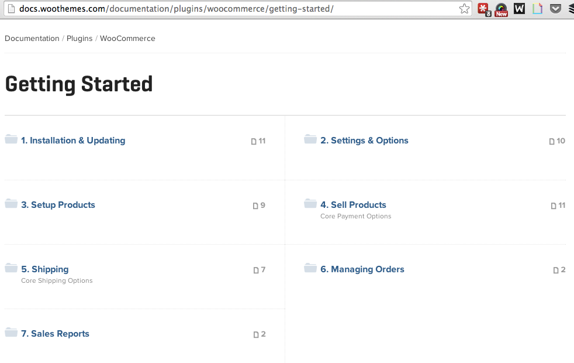
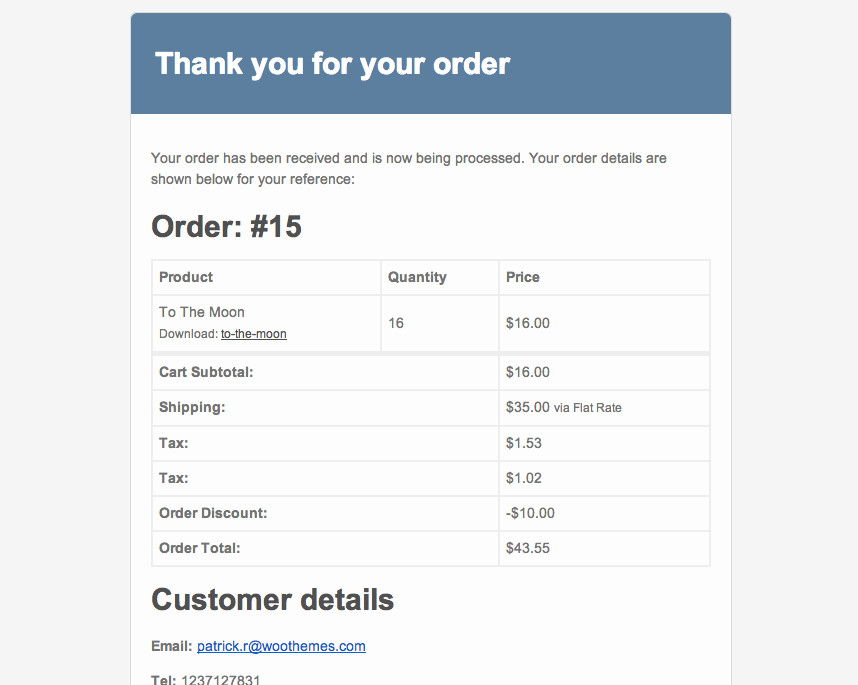
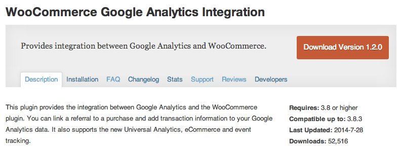

# Let's Build an E-Commerce Site in 30 Minutes!

### Patrick Rauland - @BFTrick

###  http://speakinginbytes.com/2014/08/creating-your-online-store-woocommerce/

---

# Goal

## Get an e-commerce site up and running and start testing!

^ If I could encourage you to read one book to help you get your store up and running it would be Rework by 37Signals - now BaseCamp. It's not an e-commerce book at all but their approach to software. Get things up and running and start testing. Don't worry about the details you can change them later.

---

# [fit] WooCommerce

^ E-Commerce is very complex. I promise you that no one here wants to build the exact some store as someone else. One person wants to offer (PayPal, Amazon, and Credit Card payments), someone else wants to offer discounted pricing to members, someone else wants to book massages online. WooCommerce is extensible. Very extensible.

^ Who here already has a WooCommerce store?

^ What type of store do you want to build?

---

# Other E-Commerce Solutions:

* Easy Digital Downloads
* Exchange
* PayPal Buttons
* Gumroad
* E-Junkie

---

# [fit] E-Commerce Ingredients

---

# E-Commerce Ingredients

* Products
* Payment
* Fulfillment (Order Management / Shipping / Downloads)
* Taxes
* Coupon / Sales

---

# E-Commerce Optional Ingredients

* SEO
* Email / Social Media Marketing
* Analytics
* Affiliate
* Recurring billing / Subscriptions
* Dynamic pricing (Bulk or Special User)

---

# Self Help

---

# [fit] Products

^ Okay so there are a couple ways you can add products to your store. The most obvious is to manually add products to your store.

^ You can also import an XML file.

---

# [fit] Payment

^ This is actually one of the areas that people get stuck on. There are hundreds and hundreds of payment gateways. WooCommerce has more payment gateways than any other e-commerce solution out there.

^ If you already have a brick and mortar store you probably already have a merchant account. If that's the case you should go with a traditional gateway like Authorize.net. Authorize.net AIM for most cases or Authorize.net CIM for Subscriptions.

^ If you don't have a brick and mortar store then go for a modern payment gateway. You hear every one talk about Stripe and they're pretty awesome. They're my second favorite. My favorite gateway for WooCommerce is Amazon Simple Pay. And the main reason is that it's offsite. Your user will be directed to checkout on Amazons servers. This way no matter what if your site is compromised your payments aren't.

---

# [fit] Fulfillment
# [fit] Shipping

^ My two favorite shipping methods are built right into WooCommerce. Flat rate shipping is the best way to start your store.

^ My second favorite shipping method is free shipping.

---

# [fit] Fulfillment
# [fit] Downloads

^ If you want to give users downloads you just need to mark the product as downloadable and provide a download link.

^ This is a good time to mention that you should *always* use a 3rd party SMTP provider. In short, they make sure your emails stay out of the spam folder. Look into a service called Mailgun they're free for up to 10,000 emails a month.

---

# [fit] Fulfillment
# [fit] Order Management

^ Once you have orders if you need to physically ship goods it's good to have one place to do it all. That's what the orders page is for.

^ Show a customer note with a shipping confirmation number.

---

# Emails

---

# [fit] Taxes

^ Taxes are really easy once you get the data.

^ Taxjar is coming out soon. They'll update your tax rates automatically for you.

---

# TaxJar

---

# [fit] Coupons
# [fit] & Sales

^ Coupons and sales are part of just about any e-commerce store.

---

# [fit] Reporting

^ There is one piece of reporting we have to setup. Google Analytics.

^ And another one that's already built into WooCommerce.

---

# WooCommerce Google Analytics Integration

---

## Patrick Rauland - *@BFTrick*
### WooThemes

^ So that's me. I work for WooThemes and we make WooCommerce.
